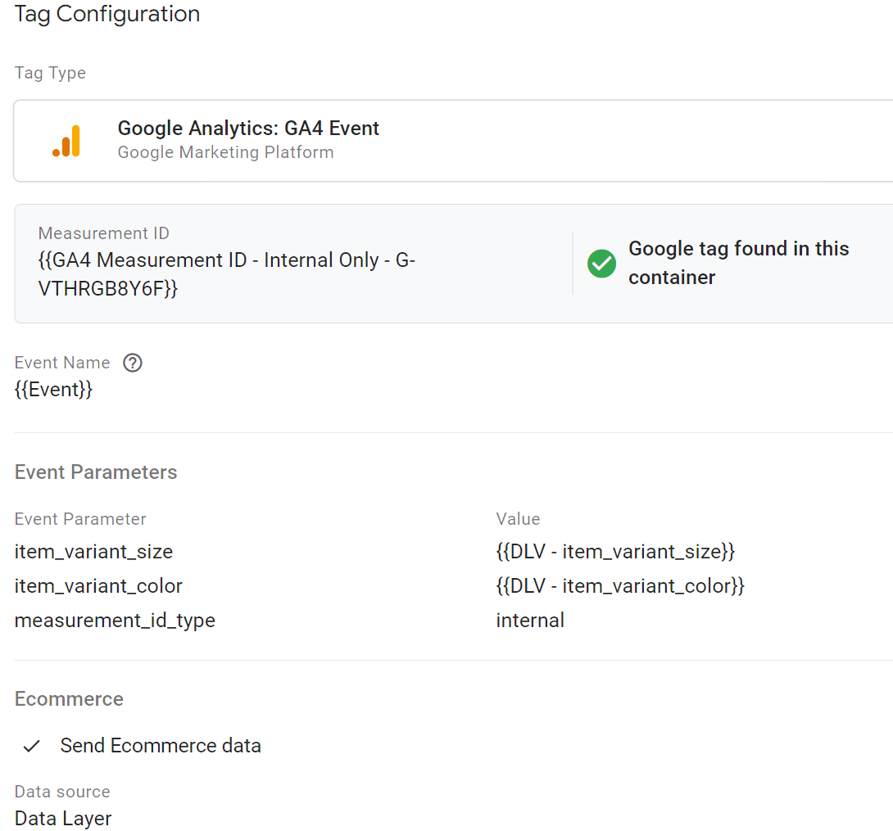
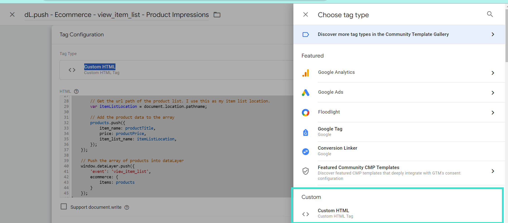

# How to Implement GA4 Ecommerce in Squarespace Using Google Tag Manager
This is a Google Tag Manager implementation guide to help Squarespace users track their ecommerce data in Google Analytics 4 (GA4).

Currently, Squarespace's native GA4 integration only tracks purchases. But if ecommerce analytics is crucial for your business, I suggest utilizing Google Tag Manager to track the entire purchase flow instead of relying on the native GA4 integration. This way, you'll have the ability to:

- See which products customers add and remove the most from their cart

- Analyze what pages people visit on your website before and after entering the purchase flow

- View how many people leave your checkout flow before purchasing

- Discover which products users view the most

**Prerequisites** Before getting started, you’ll need to create a GA4 ecommerce tag in Google Tag Manager. This is the tag that will actually send all of your ecommerce data to GA4, and fortunately it's pretty simple to set up!

### How to Set Up the GA4 Event Tag Configuration in Google Tag Manager
#### Tag Configuration

Expand to see a screenshot of GA4 Event Tag Configuration

**Tag Type:** Google Analytics: GA4 Event

**Event Name**: {{Event}} - this will push the same event name that's in the data layer to your GA4 property

**Ecommerce**: Check the "Send Ecommerce data" option

**Data source**: Data Layer

#### Trigger Configuration

Expand to see a screenshot of GA4 Event Trigger Configuration

**Trigger Type**: Custom Event > 

Event name: view_promotion|select_promotion|view_item_list|select_item|view_item|add_to_cart|view_cart|begin_checkout|remove_from_cart|purchase

Check "Use regex matching"

> [!TIP]
> These are the event names for each ecommerce event. I've also included the promotion events which I won't cover in this guide.

# How to Set Up GA4 Ecommerce Events Using Google Tag Manager
In this section, I’ll guide you through setting up new tags, triggers, and variables to send your ecommerce events to GA4 for the followng events. 
If you're only interested in a particular event, click the link to skip to that section.

- **view_item_list**: When a user views a list of products or offerings. Scroll to [this section](#view_item_list)
- **view_item**: When a user views a product. Scroll to [this section](#view_item)
- **select_item**: When a user selects a product from a list of items or offerings. Scroll to [this section](#select_item)                                 
- **add_to_cart**: When a user adds products to their shopping cart. Scroll to [this section](#add_to_cart)
- **view_cart**: When a user views their shopping cart. Scroll to [this section](#view_cart)
- **remove_from_cart**: When a user removes items from their shopping cart. Scroll to [this section](#remove_from_cart)
- **begin_checkout**: When a user begins checkout (clicks on checkout button). Scroll to [this section](#begin_checkout)
- **purchase**: When a user makes a purchase. Scroll to [this section](#purchase)

All of these ecommerce events will be implemented using GTM’s custom HTML tag type:

## view_item_list

[Get the custom code here in my repo.](ga4-ecommerce-view_item-list.html)

### Trigger Configuration:
**Trigger Type**: Page View - Window Loaded

**This trigger fires on**: Page Path equals /store

> [!TIP]
> I chose the Window Loaded trigger type to ensure the HTML elements were fully loaded on the page before firing the tag. This is is especially critical for tags where we attach event listeners to elements that might be rendered after the initial page load.

## view_item

[Get the custom code here in my repo.](ga4-ecommerce-view_item.html)

### Trigger Configuration:
There are 2 triggers for this tag
1. **Trigger Type**: Custom Event name: ssRawProductDetailPush

   OR
   
2.**Trigger Type**:  Element Visibility > Selection Method > CSS Selector > Element Selector: .sqs-product-quick-view-content

> [!TIP]
> For my Squarespace template, there are two ways for a user to view an item, by clicking the quick view button and seeing the quick view popup or by viewing the full product page. When the full product page is viewed, Squarespace automatically pushes a custom event to the data layer: ssRawProductDetailPush. 
When the quick view pops up, there’s a CSS selector associated with it (.sqs-product-quick-view-content) that I use as my trigger.

## select_item

[Get the custom code here in my repo.](ga4-ecommerce-select_item.html)

### Trigger Configuration:
**Trigger Type**: Page View - Window Loaded

**This trigger fires on**: Page Path equals /store

> [!TIP]
> My custom code attaches a click event listener to every product block on the /store page. Since I’m using an event listener, I need to use the window loaded trigger to ensure the HTML elements were fully loaded on the page before firing the tag. This is is especially critical for tags where we attach event listeners to elements that might be rendered after the initial page load.

## add_to_cart
I needed to create two separate tags for the add_to_cart event: one for when someone clicks on the adds to cart button on the store page and when someone clicks on the increment button on the cart page.

  
 Click on the Add to Cart Button

 
   [Get the custom code here in my repo.](ga4-ecommerce-add_to_cart-clicked-on-add-to-cart.html)
 
 ### Trigger Configuration:
**Trigger Type**: Click - All Elements

**This trigger fires on**: Click Text contains ADD TO CART

> 💡 You can change the click text if you’re website uses different text.

  
 Click on the Increment Button

  
[Get the custom code here in my repo.](ga4-ecommerce-add_to_cart-clicked-on-increment-button.html)
 
### Trigger Configuration:
**Trigger Type**: Click - All Elements

**This trigger fires on**: Page Path contains /cart
  Trigger Type: Page View - Window Loaded

> 💡  I chose the Window Loaded trigger type to ensure the HTML elements were fully loaded on the page before firing the tag. This is is especially critical for tags where we attach event listeners to elements that might be rendered after the initial page load.

## view_cart

[Get the custom code here in my repo.](ga4-ecommerce-view_cart.html)

### Trigger Configuration: 
**Trigger Type**: Page View - Window Loaded

**This trigger fires on**: Page Path contains /cart 

> [!TIP]
> I chose the Window Loaded trigger type to ensure the HTML elements were fully loaded on the page before firing the tag. This is is especially critical for tags where we attach event listeners to elements that might be rendered after the initial page load.

##  remove_from_cart

[Get the custom code here in my repo.](ga4-ecommerce-remove_from_cart.html)

### Trigger Configuration: 
**Trigger Type**: Page View - Window Loaded

**This trigger fires on**: Page Path contains /cart

> [!TIP]
> I chose the Window Loaded trigger type to ensure the HTML elements were fully loaded on the page before firing the tag. This is is especially critical for tags where we attach event listeners to elements that might be rendered after the initial page load.

## begin_checkout

[Get the custom code here in my repo.](ga4-ecommerce-begin_checkout.html)

### Trigger Configuration:
**Trigger Type**: Click - All Elements

**This trigger fires on**: Click Classes contains cart-checkout-button

> [!TIP]
> This code takes advantage of the JSON Squarespace creates out of the box for us. There’s actually JSON on every ecommerce page, but we can’t use it because its static on page load and doesn’t change if the user changes anything about the product or cart after the initial page load. 

## purchase

[Get the custom code here in my repo.](ga4-ecommerce-purchase.html)

### Trigger Configuration:
**Trigger Type**: Page View

**This trigger fires on**: Page Path contains /commerce/orders/

## Summary

Squarespace doesn’t make it easy to track your ecommerce data in GA4, but I’m hoping this guide helps you properly set it up in Google Tag Manager.
If you did find this repo helpful, please [let me know in the discussion board](https://github.com/martintaylorj/GA4-Ecommerce_Squarespace/discussions/1) so I know to continue creating this type of content. Have questions about the code? Let me know that too!

Want  to get insights faster? Then let me to set up your implementation! [Fill out my contact form](https://www.tayloreddata.com/book-a-discovery-call) to get started.

Thanks for reading!

